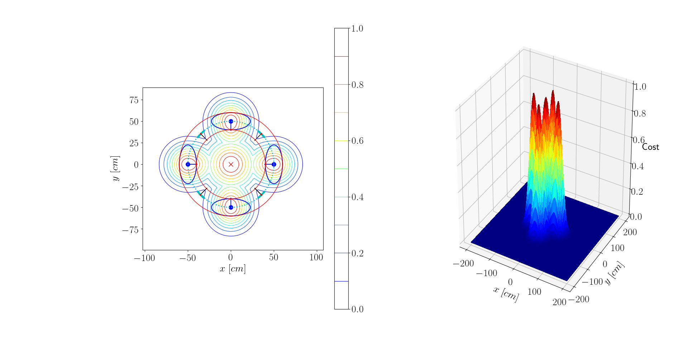

# Adaptive Space 

## Requirements
Install requirements:
```
$ pip3 install -r requirements.txt
```
## Usage
Run:
```
$ python3 space_modeling.py file.txt 
```
Example
```
$ python3 space_modeling.py groups_info.txt
```


